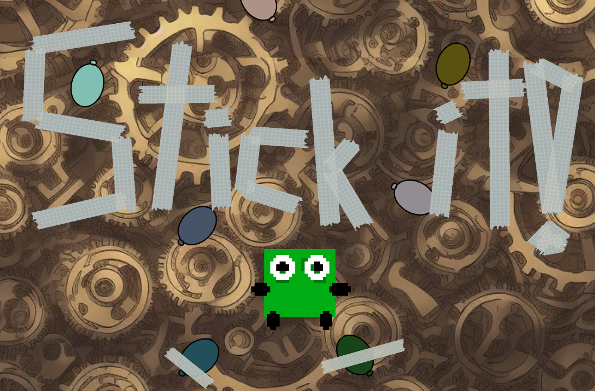
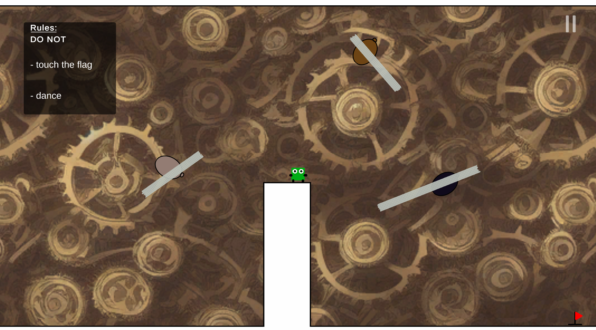
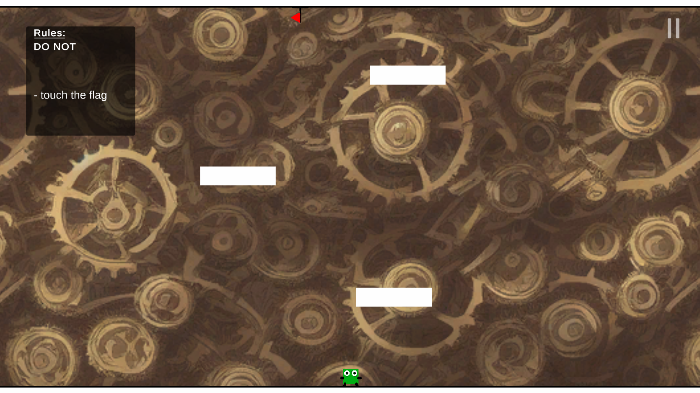
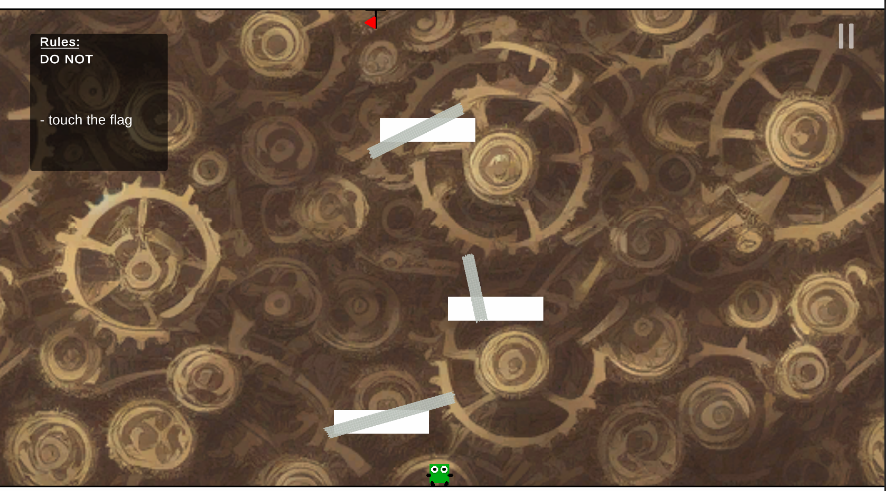
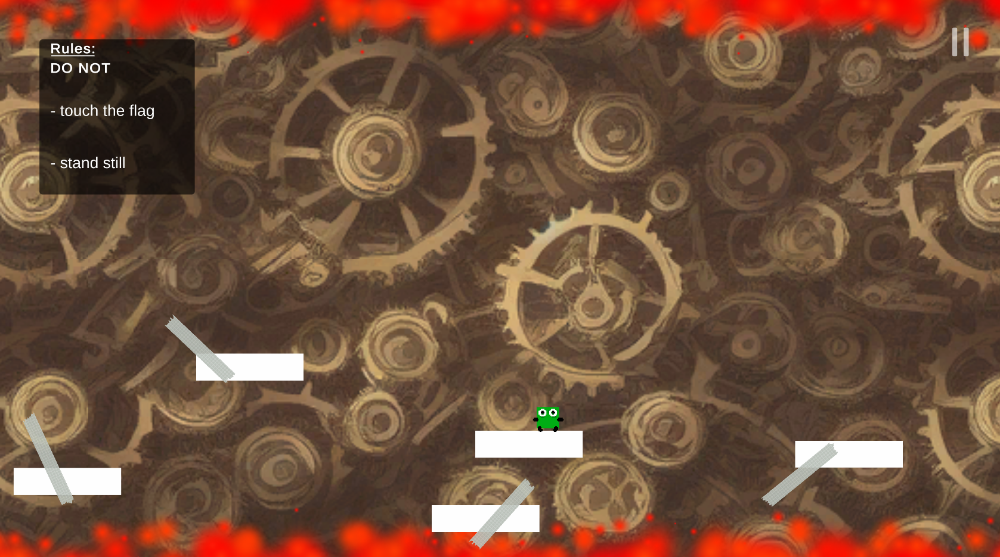

# [Stick it](https://misterixi.itch.io/stick-it) - a game jam game
This is the repository for the game jam game "Stick it" made in about 50 hours for the [Mini Jame Gam #15](https://itch.io/jam/mini-jame-gam-16) by just one person (Yannik Brändle aka MisterIXI).  

# Jam rules and special object
The jams theme was **"Break the rules"** and the special object (to serve an important role in the game) was **"Duct Tape"**.

# Gameplay
In this little puzzle platformer you can stick everything moving down with sticky tape, but also cut the sticky tape to free them again.

Check out the itch io page for a playable webGL build: https://misterixi.itch.io/stick-it

# Credits
Everything in this game was made during the jam. The background image was generated with Stable diffusion. All sounds either recorded in real life or generated with [jsfxr](https://sfxr.me/). Artwork was made with [paint.net](https://www.getpaint.net/download.html) and the game engine used was [unity](https://unity.com/).

# Screenshots

